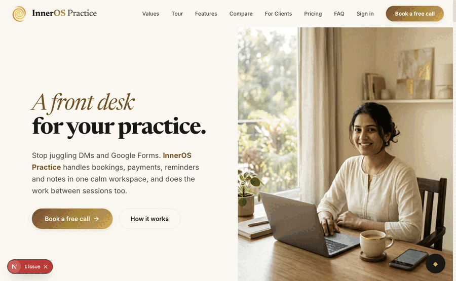

# coview

**Co-view any live page with your Claude Code session.**

`coview` docks a small chat panel into a browser tab — and that same tab is driven
by your Claude Code session over the Playwright MCP. You point at things and type;
Claude *sees the exact tab you see*, edits the code, and you watch it change live.

> You and Claude, looking at the same screen. You point. It fixes. The page updates
> in place.



```
   YOUR BROWSER  (a real page — your local dev site, or anything)
   ┌─────────────────────────────────────────────┐
   │  coview panel (draggable, minimizable)        │
   │   • type "this button does nothing"           │
   │   • Alt-click any element → pins its selector  │
   └───────────────┬───────────────────────────────┘
                   │ POST  →  bridge (localhost:7777)
                   │           writes inbox.jsonl
                   ▼
   ┌─────────────────────────────────────────────┐
   │  CLAUDE CODE session                          │
   │   • watch.sh wakes it on each message         │
   │   • Playwright MCP is attached to THIS tab    │
   │     (CDP :9222) → it screenshots / inspects   │
   │   • edits your code → reply.sh → panel toasts │
   └─────────────────────────────────────────────┘
```

Everything runs on your machine. No accounts, no network calls, no telemetry.

---

## How it works

There is no inbound channel into a running Claude Code session — so coview uses a
**local file bridge** plus a **watcher**:

```
panel → POST /msg → bridge → inbox.jsonl
                                  │
              ┌───────────────────┴───────────────────┐
              │                                        │
   MID-TURN: the Stop hook fires on every     IDLE: watch.sh (one tracked
   attempt to end a turn; if inbox has        background task) blocks on the
   unread lines it prints them + exits 2,     inbox; a new line makes it EXIT,
   which BLOCKS the stop and feeds them to     which re-invokes the session.
   the session — so messages that land
   during a long turn are never lost.
              │                                        │
              └───────────────────┬───────────────────┘
                                  │
session acts (sees the tab via the Playwright MCP), then:
   reply.sh → POST /reply → outbox.jsonl → panel polls it → shows the reply
```

Both paths share the same `cursor` file, so a message is delivered exactly once no
matter which one catches it.

The panel reaches Claude's eyes because Claude's **Playwright MCP is attached to the
same Chromium tab** over the Chrome DevTools Protocol (CDP). That attach is the one
real dependency — see below.

---

## Requirements

- **Node.js ≥ 18** (the bridge is zero-dependency, Node stdlib only)
- **bash** + `curl` + `python3` (for the helper scripts)
- A **Chromium that honors `--load-extension`** — Playwright's *Chrome for Testing*
  works. Get it with `npx playwright install chromium`. (Branded Chrome 137+
  disabled `--load-extension`, so it won't work; that's why we use Playwright's.)
- **Claude Code with the Playwright MCP** configured to attach over CDP — this is
  the core dependency. ⤵

### The Playwright MCP dependency

coview does not drive the browser itself. Your Claude Code session does, through the
[Playwright MCP](https://github.com/microsoft/playwright-mcp). It must be configured
to **connect to the Chromium that `launch.sh` opens** (not launch its own), via
`--cdp-endpoint`.

Add this server to your project's `.mcp.json` (or `~/.claude.json`):

```json
{
  "mcpServers": {
    "playwright-cdp": {
      "command": "npx",
      "args": ["@playwright/mcp@latest", "--cdp-endpoint", "http://localhost:9222"]
    }
  }
}
```

Then reconnect MCP in Claude Code (run `/mcp`). After `launch.sh` opens Chromium on
port 9222, Claude's `playwright-cdp` tools control that exact tab.

---

## Quick start

```bash
git clone https://github.com/inneros/coview.git && cd coview
chmod +x *.sh hooks/*.sh

# 1. register the Stop hook once (idempotent) — keeps the channel alive mid-turn
./install-hooks.sh

# 2. open the browser + bridge, pointed at your page
./launch.sh http://localhost:3000

# 3. in Claude Code: make sure playwright-cdp is in .mcp.json (see above), run /mcp,
#    then tell Claude:  "attach to the coview tab and arm the watcher"
```

From here you talk in the panel; Claude responds in the panel and edits your code.
The fastest path is to let Claude set it all up for you — see the skill below.

---

## One-shot setup (let Claude Code do it)

Paste this into your Claude Code session. It codifies the whole setup; `SKILL.md` in
this repo is the same instructions as an installable skill.

> **coview setup**
> 1. Run `./install-hooks.sh` once — it registers coview's Stop hook in
>    `~/.claude/settings.json` (idempotent) so panel messages that arrive mid-turn
>    are never lost. It's inert outside a live coview session.
> 2. Ensure a `playwright-cdp` MCP server exists in `.mcp.json` with args
>    `["@playwright/mcp@latest", "--cdp-endpoint", "http://localhost:9222"]`. If you
>    add it, tell me to run `/mcp` to reconnect, then continue.
> 3. Run `./launch.sh <URL>` (default `http://localhost:3000`) as a background task —
>    it starts the bridge, opens Chromium with the extension on CDP :9222, and arms
>    the Stop hook by creating the `active` sentinel.
> 4. Attach: call the `playwright-cdp` `browser_tabs(list)` tool until it returns the
>    tab, then `browser_navigate` to the target URL if needed.
> 5. Arm the idle path: run `./watch.sh` as a **tracked background task**. It catches
>    a message that arrives while the session is fully idle (the Stop hook can't fire
>    on an already-stopped session). When it exits it hands you the new panel
>    message(s) — act on them (screenshot the pinned element, edit code), then
>    `./reply.sh "<your reply>"` and re-run `./watch.sh`. Messages that arrive
>    mid-turn are handled automatically by the Stop hook — no manual re-arm needed.
> 6. Confirm by sending one `./reply.sh "coview is live"` so I see it in the panel.

---

## The wake loop (for the curious)

Two mechanisms keep the channel alive, each covering what the other can't:

**1. The Stop hook (mid-turn) — `hooks/stop-hook.sh`.** Claude Code runs a `Stop`
hook every time the assistant tries to *end a turn*. coview's hook checks the inbox:
if there are unread lines it prints them to stderr, advances the `cursor`, and
**exits 2** — which tells Claude Code to **block the stop and feed that stderr back
to the model** as a new prompt. So a panel message that arrives in the middle of a
long turn (many tool calls, no natural stop) is picked up the instant the turn tries
to end, instead of sitting unread until the session happens to re-arm a watcher. The
cursor is the loop guard: once delivered, a later stop with no *new* lines exits 0
and the turn ends normally. The hook is **inert** in any non-coview session — it
only does anything while `$COVIEW_DIR/active` exists (created by `launch.sh`,
removed when it exits). Install it once with `./install-hooks.sh` (idempotent).

**2. `watch.sh` (idle bootstrap) — a one-shot-but-resumable blocker.** A Stop hook
can only fire when the assistant *attempts to stop*; it cannot fire on a session
that is already fully idle. `watch.sh` covers that gap: run once as a tracked
background task, it polls `inbox.jsonl` and, when a line arrives while the session
sits idle, **prints it and exits** — exiting is what re-invokes the session.

- Both read/advance the **same `cursor` file**, so a message is delivered exactly
  once whether the hook or the watcher catches it — no missed, no repeated.
- `watch.sh` exists because a plain `tail -f | grep` never exits on a single match
  (tail holds the pipe open), so the session would never wake.

---

## Theming

coview ships with a warm default palette. Re-theme **per instance without touching
the repo** — the bridge serves a theme that the panel reads on boot:

- **`$COVIEW_DIR/theme.json`** (default `~/.coview/theme.json`), or
- **`COVIEW_THEME`** as a JSON env var.

```json
{ "bg": "#ffffff", "ink": "#111827", "accent": "#4f46e5", "line": "#e5e7eb" }
```

Keys (`bg`, `ink`, `accent`, `line`) are all optional; unset ones keep the default.
The shipped default lives in `DEFAULTS` at the top of `extension/content.js`.

## Configuration

| Env | Default | What |
|-----|---------|------|
| `COVIEW_PORT` | `7777` | bridge port (also set in `extension/background.js`) |
| `COVIEW_CDP_PORT` | `9222` | Chromium remote-debugging port (match `--cdp-endpoint`) |
| `COVIEW_DIR` | `~/.coview` | state dir (`inbox.jsonl` / `outbox.jsonl` / `cursor` / `theme.json`) |
| `COVIEW_THEME` | — | JSON theme override (or use `$COVIEW_DIR/theme.json`) |
| `COVIEW_CHROME` | auto | explicit Chromium binary (skips auto-discovery) |

---

## Troubleshooting

Three non-obvious things, learned the hard way:

- **Panel doesn't appear, but the extension loaded.** Frameworks that render
  `<html>`/`<body>` via the framework (e.g. **Next.js App Router**) strip foreign
  nodes during hydration. coview self-heals with a `MutationObserver` that re-appends
  the panel — make sure you're on the latest `content.js`.
- **Extension won't load at all.** You're probably on branded Chrome. Use Playwright's
  *Chrome for Testing* (`npx playwright install chromium`); `launch.sh` finds it.
- **Claude doesn't wake on a message.** The watcher must be a **tracked background
  task** that *exits* on a new message. If you used `tail -f | grep`, it hangs open
  and never wakes the session — use `watch.sh`.

Other:
- **Panel can't reach the bridge on some sites** (strict CSP). The extension routes
  fetches through its background service worker, which isn't subject to page CSP, so
  this normally works. If you run the bridge on a non-default port, update
  `BASE` in `extension/background.js` too.

---

## Security

coview is **local-only by design**. The bridge binds to `127.0.0.1`, there is no
auth, and there are no outbound calls. Do not expose the bridge port or the CDP port
to a network.

## License

MIT — see [LICENSE](./LICENSE).
